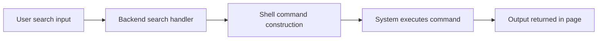
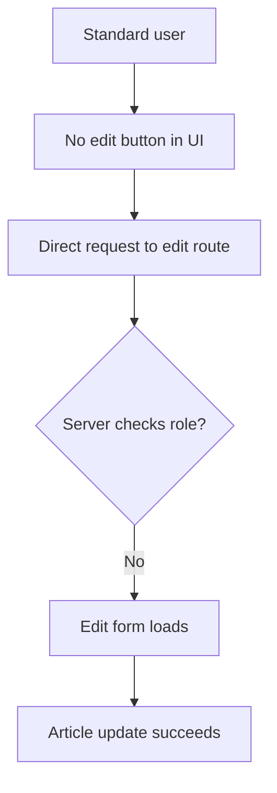
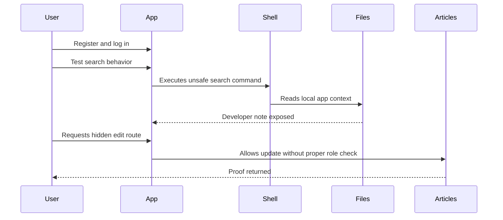

<p align="center">
  
</p>

<p align="center">
  
  
  
  
</p>

# NewsForge: Reading Between the Headlines

NewsForge is a clean little blog platform with the familiar rhythm of a community news site: register, log in, browse stories, and search for articles. On the surface, everything feels intentionally simple.

That simplicity is what makes the lab useful. The interesting behavior is not hidden behind a huge attack surface. It appears in a normal feature, in a normal workflow, doing something just unusual enough to reward curiosity.

This writeup avoids the final flag, exact sensitive route, and copy-paste exploit strings. It is meant to document the thought process without turning the lab into a checklist.

---

## Lab Snapshot

| Field | Notes |
| --- | --- |
| Box | NewsForge |
| Platform | Webverse Pro |
| Category | Web application security |
| Difficulty | Easy |
| Main themes | Search behavior, command execution, authorization checks |
| Spoiler level | Low |

---

## First Impressions

The application presents itself like an old-school news portal:

- Public article listing
- User registration and login
- Member-only site search
- Individual article pages
- A small set of visible routes

Nothing immediately screams "admin panel" or "obvious secret page." That is a good sign in a beginner lab: the vulnerability is discoverable, but you still need to ask what each feature is really doing.

<p align="center">
  
</p>

---

## Recon Notes

The first useful observation was that the service expects a hostname rather than only the raw IP address. Once the virtual host was used correctly, the blog loaded and exposed the intended app.

The normal flow was:

```text
visit app -> create account -> log in -> access member search
```

The search page is the first place where the app hints at something broader than article lookup. Its wording suggests that it searches across more than just article titles and bodies.

That small wording detail matters.

---

## The Search Feature

The search box behaves like a content search from the user's point of view, but the output tells a different story. Testing harmless inputs shows that the backend is not only querying article data.

At a high level, the issue looks like this:



The important lesson is not the exact payload. The important lesson is the design failure:

> User-controlled input reached a shell execution path without safe handling.

Once that was confirmed with low-impact commands, filesystem exploration became possible from inside the application context.

---

## Sensitive Information Exposure

After confirming the search behavior, I looked for nearby files that should not be exposed through a web feature. One developer note stood out.

It contained enough internal context to reveal that an article-editing route existed and that the authorization check was incomplete.

No secret route is included here, but the shape of the issue was clear:

```text
developer note -> internal edit route -> missing role check -> standard user can reach edit function
```

This is where the lab connects two separate weaknesses:

- Command injection exposes internal files.
- Broken function level authorization makes an internal function usable by the wrong role.

Either bug is bad. Together, they create a clean exploitation path.

---

## Authorization Bypass

The article edit function was not linked from the standard user's interface, but it was still reachable directly.

That distinction is important:



Hiding a button is not authorization. Hiding a route is not authorization. A backend route must verify whether the current user is allowed to perform the action every time the action is requested.

---

## Impact

The final proof was editing an article as a normal logged-in user. That demonstrated the real impact:

- A non-admin user could access an editing workflow.
- Article content could be changed.
- The application confirmed the action after saving.

I am intentionally omitting the final flag and exact route. If you are working through the lab, the discovery is the valuable part.

<p align="center">
  
</p>

---

## What NewsForge Teaches

This lab is a compact reminder that web vulnerabilities often chain through ordinary features.

### 1. Search boxes are not harmless

Search often touches databases, files, indexes, subprocesses, or external services. Any time input crosses into one of those systems, validation and safe APIs matter.

### 2. Developer notes are sensitive

Internal notes can reveal routes, assumptions, unfinished work, credentials, or deployment details. If a file is not meant for users, the application should not be able to expose it.

### 3. UI is not access control

If a user can send the request manually, the server must decide whether that user is allowed to perform the action.

### 4. Small bugs become bigger in chains

The search issue provided information. The authorization issue provided impact. The chain is what made the lab interesting.

---

## Defensive Takeaways

If I were hardening this app, I would focus on:

- Replace shell-based search with a safe search implementation.
- Avoid constructing shell commands from user input.
- Store internal notes outside the deployed app directory.
- Add server-side role checks to every article edit route.
- Add tests for direct requests to restricted endpoints.
- Log suspicious search patterns and failed authorization attempts.

Example authorization test idea:

```text
Given a standard authenticated user
When they request an article edit endpoint directly
Then the server should return 403 Forbidden
And the article should remain unchanged
```

---

## Kill Chain Summary



---

## Final Thoughts

NewsForge is a strong beginner lab because it rewards careful observation instead of brute force. The route from "odd search output" to "unauthorized content editing" is short, clear, and realistic enough to stick.

The main lesson: when a feature accepts user input, ask where that input goes next. When a route changes data, ask who is allowed to call it.

---

## Tags

`web-security` `ctf` `appsec` `command-injection` `bfla` `authorization` `webverse` `writeup` `ethical-hacking`

---

<p align="center">
  
</p>
