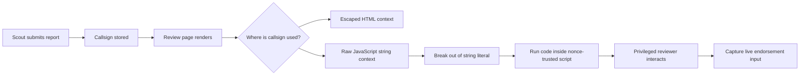
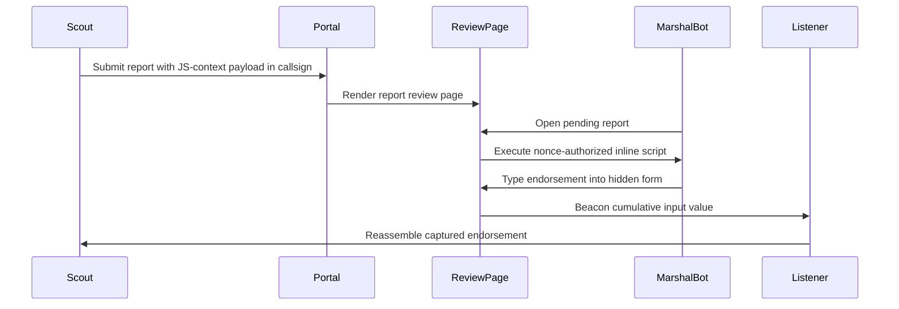

# WebVerse Pro: NorthKorea

> A creative, spoiler-light writeup for the WebVerse Pro **NorthKorea** lab.  
> Lab link: [NorthKorea on WebVerse Pro](https://dashboard.webverselabs-pro.com/labs/northkorea)


## Opening Scene

The premise is simple enough: you are given a low-privilege scout account inside a military-themed command portal. You can submit field reports, and a privileged reviewer later opens them in a browser automation session.

The prize is not sitting in the database. It is not printed in the HTML. It is not available to the scout account.

It appears only during a live privileged review flow.

That detail changes the shape of the challenge. This is not about dumping stored data. It is about making the page do the work at the exact moment the privileged user interacts with it.

## TL;DR

NorthKorea is a client-side web lab about **JavaScript-context injection under a nonce-based Content Security Policy**.

The important lesson is that CSP nonces are not magic armor. They stop unauthorized script tags from running, but they do not save you if attacker-controlled text is inserted directly into an already trusted script block.

No literal flag is included in this writeup.

## Recon Notes

The application has a small, focused surface:

- A login page
- A scout dashboard
- A report submission form
- A report review page
- A privileged review bot

The scout can create reports with two fields:

| Field | Purpose |
| --- | --- |
| `callsign` | Displayed as report metadata |
| `body` | Displayed as the report content |

The key observation is that the callsign is used in more than one context. In the visible HTML, it is escaped correctly. In an inline JavaScript block, it is interpolated into a string literal.

That second context is where the box lives.

## The Page Shape

The review page contains a nonce-authorized inline script that looks conceptually like this:

```js
var operative = {
  callsign: "USER_CONTROLLED_CALLSIGN",
  report_id: 123,
  viewed_at: new Date().toISOString()
};
```

The page also sends a strict-looking CSP header:

```http
Content-Security-Policy:
  default-src 'self';
  script-src 'nonce-...';
  style-src 'self' 'unsafe-inline';
  img-src 'self' data: *;
  connect-src *;
  frame-ancestors 'none';
  base-uri 'none'
```

At first glance, this looks hardened. New attacker-supplied `<script>` tags will not run because they do not have the server-generated nonce.

But the vulnerable input is not trying to create a new script tag.

It is being placed inside a script block that already has the nonce.

## Mental Model



The CSP is doing its job against unauthorized script sources. The bug is that the application has already invited untrusted data into an authorized script.

## The Vulnerability

This is not classic HTML injection like:

```html
<script>alert(1)</script>
```

That is exactly the kind of thing the nonce policy is designed to block.

The useful payload shape is instead a JavaScript string breakout:

```js
"}; /* injected JavaScript runs here */ operative = { callsign: "
```

The goal is to:

1. Close the existing string.
2. Close or neutralize the surrounding object syntax.
3. Run controlled JavaScript.
4. Recreate enough syntax afterward so the original script still parses.

This fourth point matters. A broken script may fail before the useful code is installed.

## Why the Flag Is Live

The privileged reviewer does not simply reveal a stored secret. The endorsement is typed during review and is not persisted in a useful way for the scout.

So the exploit has to be waiting before the reviewer starts typing.

The practical strategy is a small keylogger or input logger attached to the endorsement form:

```js
document.addEventListener("input", event => {
  // Send the current textarea value to an attacker-controlled listener.
});
```

The lab allows outbound browser requests to a VPN-reachable listener. That makes it possible to collect the typed endorsement incrementally as the review bot enters it.

## Exploit Flow



The important detail is that each beacon can contain the current value of the text field, not just a single character. That makes reconstruction easier and more reliable if any request is delayed or missed.

## What Made This Box Interesting

The challenge is a good reminder that "CSP is present" is not the same as "XSS is impossible."

CSP answers questions like:

- Which scripts are allowed to execute?
- Which network destinations can scripts talk to?
- Can inline scripts run?
- Are nonces or hashes required?

But CSP does not automatically answer:

- Is untrusted data being inserted into a JavaScript parser context?
- Is the application serializing values safely?
- Can attacker-controlled data alter the meaning of an already trusted script?

In this lab, the browser trusted the script block because the nonce was valid. The application made the mistake of letting untrusted input become part of that trusted script.

## Defensive Takeaways

The fix is not "remove CSP." The fix is to keep CSP and stop mixing raw user input into executable contexts.

Good defensive patterns:

- Avoid placing user-controlled values directly inside inline JavaScript.
- If data must be passed to JavaScript, serialize it with a real JSON encoder.
- Prefer inert data containers such as `data-*` attributes or `<script type="application/json">`.
- Use `textContent` for DOM updates, not HTML parsing.
- Treat JavaScript string context as a separate escaping problem from HTML context.
- Keep CSP strict, but do not rely on it as the only XSS control.

Example safer pattern:

```html
<script type="application/json" id="report-data">
  {"callsign":"safely JSON encoded value"}
</script>
```

Then parse it:

```js
const data = JSON.parse(document.getElementById("report-data").textContent);
document.getElementById("callsign-display").textContent = data.callsign;
```

## Final Thoughts

NorthKorea is a compact but sharp lab. It rewards reading the page like a browser does: not just looking at where input appears, but asking which parser consumes it next.

The win condition comes from combining three ideas:

- CSP nonce behavior
- JavaScript string-literal breakout
- Live capture during privileged browser interaction

That combination makes the box feel less like a checklist and more like a small browser-security story.

If you want to try it yourself, the lab is here:

[https://dashboard.webverselabs-pro.com/labs/northkorea](https://dashboard.webverselabs-pro.com/labs/northkorea)

---

## Tags

`#WebSecurity` `#CyberSecurity` `#CTF` `#WebExploitation` `#XSS` `#CSP` `#JavaScript` `#AppSec` `#WebVerse`
