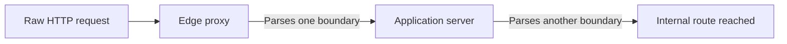

<div align="center">


<br />

[](#the-archive)
[](#field-guide)
[](#responsible-use)

<br />

> **Observe the surface. Model the trust boundary. Prove the chain. Document the lesson.**

A practical archive of WebVerse Pro lab walkthroughs, challenge notes, and methodology built for people who want to understand *why* a path works—not merely that it works.

</div>

---

## The Archive

WebVerse Pro is a growing collection of hands-on security labs. This repository turns each completed environment into a durable reference: the recon that mattered, the assumptions that failed, the exploit chain that held, and the defensive lesson left behind.

```text
  RECON ──> EVIDENCE ──> HYPOTHESIS ──> VALIDATION ──> ACCESS ──> LESSON
    │                                                                  │
    └─────────────────────── document the reasoning ──────────────────┘
```

<table>
<tr>
<td width="33%" valign="top">

### Evidence first

Services, response behavior, source artifacts, and protocol details decide the next move. Tools gather evidence; they do not replace the model.

</td>
<td width="33%" valign="top">

### Full-chain learning

Retired and authorized material includes the commands, payloads, credentials, pivots, and outcomes needed to reproduce the reasoning responsibly.

</td>
<td width="33%" valign="top">

### Defender-minded notes

Every useful offensive path is also a trust-boundary failure. Writeups connect the technique to detection and remediation.

</td>
</tr>
</table>

---

## Publication Philosophy

This archive is designed to be **useful at the keyboard**. For retired labs and explicitly authorized training environments, guides may include exact commands, recovered credentials, payloads, full exploit chains, and completion evidence. The goal is reproducibility—not vague advice that leaves the hardest reasoning implicit.

| Published here | Kept spoiler-safe or excluded |
|---|---|
| Validated commands and tool usage | Active or unreleased lab solutions |
| Credentials and access paths from retired/authorized labs | Credentials for real systems or third parties |
| Payload construction and protocol-level evidence | Techniques used outside explicit authorization |
| Dead ends, corrections, and the reasoning behind the route | “Run this blindly” instructions without context |
| Detection and hardening takeaways | Material that would compromise a live environment |

> **The standard is simple:** share the full chain when it supports authorized learning; preserve the boundary when a target is active or not yours to test.

---

## Field Guide

### Full Environment Writeups

| Environment | Focus | Guide |
|---|---|---|
| **BombThreat** | Web exploitation and attack-chain analysis | [Open guide](./BombThreat_Guide.md) |
| **DocketHive** | Web application enumeration and compromise | [Open guide](./DocketHive.md) |
| **Inked** | Web service investigation and exploitation | [Open guide](./Inked.md) |
| **JurryHurry** | Application attack surface and validation | [Open guide](./JurryHurry.md) |
| **NewsForge** | Web workflow and trust-boundary analysis | [Open guide](./NewsForge.md) |
| **NorthKorea** | Web exploitation methodology | [Open guide](./NorthKorea.md) |
| **Parcel** | Web service enumeration and attack path development | [Open guide](./Parcel.md) |
| **PhotoStore** | Application logic and web security testing | [Open guide](./PhotoStore.md) |
| **ReportVerse** | Web application attack-chain analysis | [Open guide](./ReportVerse.md) |
| **Spread** | CL.TE HTTP request smuggling and proxy bypass | [Open guide](./spread-writeup.md) |

### Challenge Notes

Small environments, focused concepts, and compact walkthroughs for sharpening a single idea at a time.

| Challenge | Guide | Challenge | Guide |
|---|---|---|---|
| Brackish Brewing | [Read](./brackish-brewing.md) | Coltsfoot Community Center | [Read](./coltsfoot-community-center.md) |
| Cookie Cutter | [Read](./cookie-cutter.md) | Halftrack Model Railroad Club | [Read](./halftrack-model-railroad-club.md) |
| HammerHopper | [Read](./HammerHopper.md) | Header Hunt | [Read](./header-hunt.md) |
| Hollow Run Bedding | [Read](./hollow-run-bedding.md) | Lake Forks Permits | [Read](./lake-forks-permits.md) |
| Loop and Roam Records | [Read](./loop-and-roam-records.md) | Pebble and Pine | [Read](./pebble-and-pine.md) |
| QuikPay Receipts | [Read](./quikpay-receipts.md) | Ridgeline Hotels Session Swap | [Read](./ridgeline-hotels-session-swap.md) |
| Spindrift Workspace | [Read](./spindrift-workspace.md) | Vellichor Press | [Read](./vellichor-press.md) |

---

## Spotlight: Spread

> *A weekend CSV tool has an operations console blocked by an edge proxy—but the application trusts the network behind it.*



| Surface | Detail |
|---|---|
| **Technique** | CL.TE HTTP request smuggling |
| **Concepts** | Proxy bypass, Content-Length / Transfer-Encoding desynchronization, keep-alive poisoning |
| **Stack** | Gateway proxy + Gunicorn / Flask |
| **Core lesson** | A proxy path block is not application-layer authorization |
| **Writeup** | [`spread-writeup.md`](./spread-writeup.md) |

---

## How to Read a Writeup

```text
01  Map the exposed surface        What does the target actually reveal?
02  Separate facts from guesses    Which claim is supported by evidence?
03  Test one hypothesis at a time  What result would confirm or reject it?
04  Trace the trust boundary       Where does one component trust another?
05  Reproduce and explain          Why did the final chain work?
06  Defend the lesson              How should this be detected or prevented?
```

The strongest takeaway is rarely a particular command. It is the ability to recognize the same broken assumption in the next environment.

---

## Toolkit

<table>
<tr>
<td width="50%" valign="top">

### Discovery and validation

- [Burp Suite](https://portswigger.net/burp)
- [Caido](https://caido.io)
- [curl](https://curl.se) and raw sockets
- [Nmap](https://nmap.org)
- [FFuF](https://github.com/ffuf/ffuf)
- [httpx](https://github.com/projectdiscovery/httpx)

</td>
<td width="50%" valign="top">

### References and mental models

- [PortSwigger Research](https://portswigger.net/research)
- [OWASP Web Security Testing Guide](https://owasp.org/www-project-web-security-testing-guide/)
- [HTTP Semantics](https://httpwg.org/specs/)
- [HackTricks](https://book.hacktricks.xyz)

```text
The proxy is not the app.
The response is not the whole system.
Trust boundaries are where bugs live.
```

</td>
</tr>
</table>

---

## Repository Map

```text
WebVerse-Pro-/
│
├── README.md                         ← archive navigation
├── *Guide.md / *.md                  ← full environment writeups
├── challenge-name.md                 ← focused challenge notes
└── spread-writeup.md                 ← request-smuggling deep dive
```

Paths stay stable so that bookmarks, linked writeups, and references continue to work.

---

## Responsible Use

Everything in this repository is intended for **authorized security training, lab environments, and defensive learning**.

- Test only systems you own or have explicit permission to assess.
- Treat published lab credentials as lab-only artifacts, never as material for credential reuse.
- Use the full chains to improve investigation, engineering, and detection—not to target real systems.
- If a guide is too revealing for an active environment, keep it private until that boundary changes.

---

<div align="center">

[](https://dashboard.webverselabs-pro.com)
[](https://github.com/tonyb760)

<br />


<sub>Built for curiosity, repeatability, and responsible practice.</sub>

</div>
